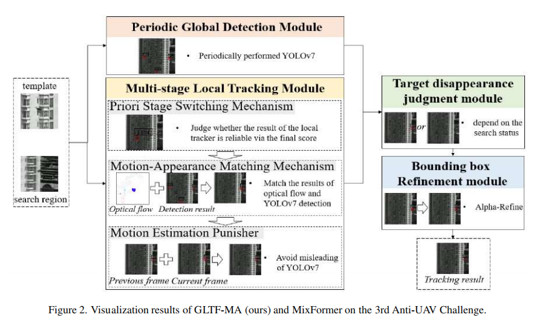
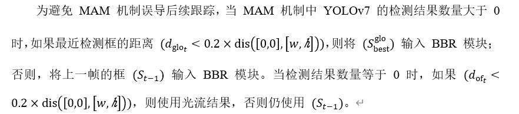

本文章提出了GLTF-MA模型，用于解决无人机频繁消失和不稳定飞行路径问题

上图是该模型的架构图，可以看到该模型包括了四个模块，

## 周期性全局检测模块（PGD）

每隔 I 帧对整幅图像进行全局无人机检测。如果检测结果中最佳框的置信度分数大于阈值 δ，则选择该框作为当前帧的跟踪结果；否则，执行 MLT 模块以搜索目标位置。

## 多阶段局部跟踪模块（MLT）

该模块包括了三个小模块

**先验阶段切换机制（PSS）**

跟踪器失效时其SPM得分可能还是很高，成为误判，为了解决这个问题，引入了先验知识。其计算公式如下。
$$
F_s=\mathrm{SPM}110\times\left(4\times P_{\mathrm{area}}P_{\mathrm{move}}\frac{P_{\mathrm{ratio}}}{1000}\right)
$$

$$
(P_{\mathrm{area}})：绝对面积惩罚\\
(P_{\mathrm{move}})：移动距离惩罚\\
(P_{\mathrm{ratio}})：比例变化惩罚
$$

如果值大于阈值认为得分可靠直接输入BBR模块，否则激活MAM机制。

**运动-外观匹配机制（MAM）**

一方面使用 YOLOv7 在整幅图像上检测无人机；另一方面，利用光流计算得到最显著的运动位置。接着，将 YOLOv7 的多个检测框与其匹配，以找到最可能的目标区域。

**运动估计惩罚器（MEP）**

## 目标消失判断模块（TDJ）

根据上面所述的当检测数量为0时，切使用St-1的情况被认为是无人机超出了目标检测范围，其他情况认为目标人在画面内。

## 边界框优化模块（BBR）

BBR 模块的核心组件是 Alpha-Refine，包括像素相关、角点预测头和辅助掩膜头，以显著提升预测框的质量。