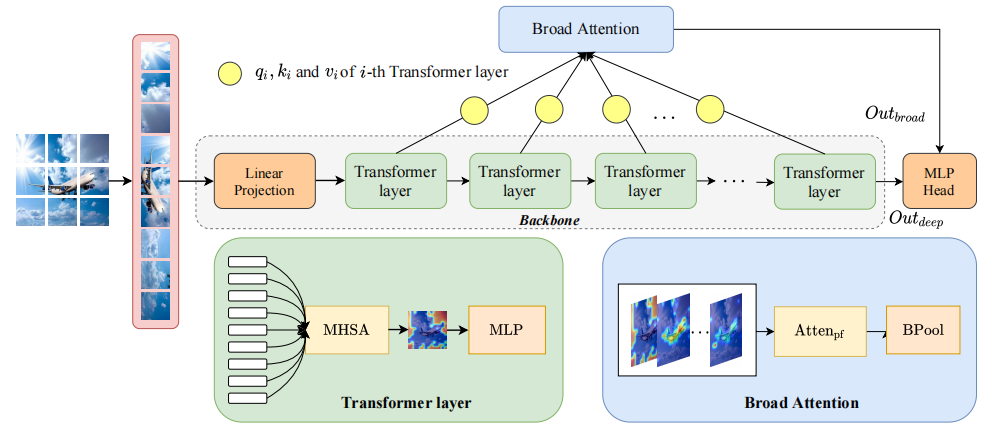
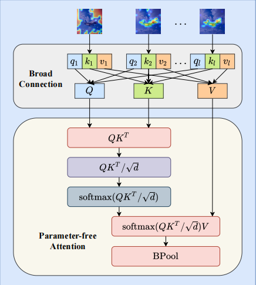

# 动机

现有的利用自注意力机制进行图像分类的方法只考虑了单一特征层中的注意力，忽略了不同层之间注意力的互补性。为了改善这个问题，本文提出了一种称为“广义注意力”（Broad Attention）的方法，称为BViT。

# 方法

上图是BViT的架构图，与ViT模型相似，图形被拆分成图像块，经过线性层转换成向量，输入Transformer层，每个Transformer层就只Transformer的Encoder层，多层的Transformer模块（灰色部分）负责深度特征提取，将每层的Transformer的输出作为Broad Attention的输入，用于广泛特征提取。

Transformer层的详细内容参见之前的文章。

上图为Broad Attention的具体结构图，具体来说，先将每个Transformer层输出的qkv矩阵拼接在一起作为新的QKV矩阵，输入无参数注意力层（Parameter-Free Attention），计算公式为
$$
Atten_ {pf}(Q,K,V)=softmax(\frac{QK^T}{\sqrt{d}})V
$$
再将输出进入BPool进行维度对齐，公式为
$$
Out_{broad}=BPool(Atten_{pf}(Q,K,V),{d_p})
$$
这样就得到了两个输出，一个是由Transformer层直接的输出Outdeep，和Broad Attention的输出Outbroad，在引入系数因子γ调节权重，最终的输出为
$$
Out=Out_{deep}+γ⋅Out_{broad}
$$

# 实验

本模型使用了Imagenet数据集，训练了300轮，实验表明相比于ViT提升了约3%在，之后将模型迁移到CIFAR10/100，提升了更改的准确率。此外，将广义注意力应用于T2T-ViT、LVT和Swin Transformer同样带来了超过1%的准确率提升。