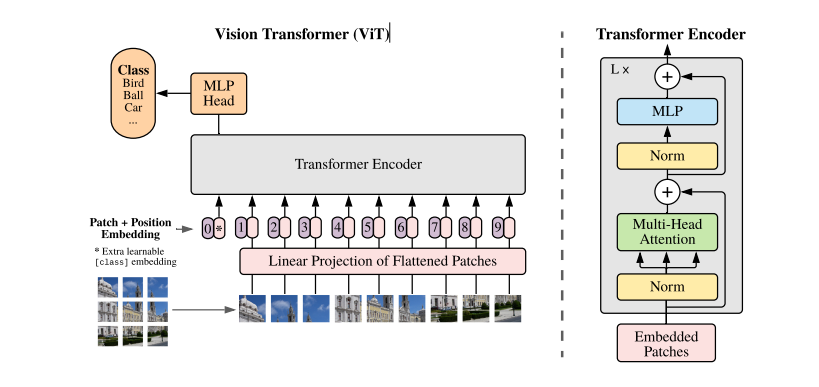

# Vision Transformer（VIT）

由于Transformer在自然语言处理（NLP）表现十分良好，于是作者试图将Transformer应用在图像分类上。

上图就是作者为适应Transformer模型对图像进行的预处理过程，其中Transformer Encoder使用的就是最原始的Transformer模型。

具体来说，由于Transformer模型的自注意力机制是对每个输入进行两两计算，直接将图像中的像素作为输入会产生十分巨大的计算量，为了减少计算量，首先将一个图形按16*16大小划分为一个块，将一个图形分为多个快，将每一个块作为一个输入进行训练。

举个例子，我们有一张48 * 48 * 3大小图片，我们按16*16大小作为一个块，这样就会有一个3 *3的块，如上图，这样就将输入的大小从48 * 48 * 3转换成9*768，这九个作为Transformer的输入进行训练。

我们注意到进入Transformer训练的输入除了图像信息，还有一个Patch+Position Embedding输入，这个输入能自动匹配输入的图形大小，生成相应大小的矩阵（比如这里图像输入大小是9 *768，它就会生成一个1 *768大小的矩阵，所以总的输入大小是10 * 768），利用自注意力机制与图像输入进行交互学习，获得图像块的位置信息。最后的输出仅使用该输入的纯输出作为结果。

