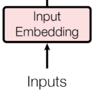

# 架构总览

这是Transformer架构的基础架构图，大致可以分为两个部分，左侧是Encoding层，右侧是Decoding层，每个编码器与解码器会重复N次，接下来将详细解释每个模块的原理，作用。

## 输入层

### 输入：文字转向量

这一部分是模型的输入部分，很简单的将输入进的词语拆分成一个一个单词，并将每个单词转换为一个长为 dmodel大小的向量。最终转换为n*dmodel大小的向量，其中n为输入句子中的单词量，比如”你好世界“的n的大小为4。

### 添加时序信息

这一部分的目的是上一部分n*dmodel加入时序信息，利用下面公式 进行信息添加，具体来说，对于每个词，当其位置在奇数位置是，使用cos函数计算对应的位置信息，对偶数位置的词使用sin函数计算相应位置，最终将对应的词向量与位置信息相加，作为下一步的输入。这样的做法为输入加入了时序信息。
$$
P E_{(pos,2i)} = sin(pos/10000^{2i/dmodel})\\
P E_{(pos,2i+1)} = cos(pos/10000^{2i/dmodel})
$$
## Encoding（编码器）

整个编码器部分分为两个模块，首先是多头注意力机制模块，其次是前馈神经网络，对于每个模块都使用了残差链接

### 多头注意力机制

上图就是多头注意力机制的模型图，

可以看到，多头注意力模块的输入是三份相同的输入，分别代表了Query（Q)，Key（K)，Value（v)三个矩阵，其中Q代表的是待查询的词语，K是已知的词语，V是K与Q的相似度。使用下方公式计算
$$
Attention(Q, K, V ) = softmax(\frac{QK^T}{\sqrt[]{d_k}})V
$$
其中多头的具体含义是，将原始数据（比如512维）经过线性层分为八个头，每个头都是64维，分别训练后，在将训练结果连接，再经过线性层成为512维（8*64）的数据。具体流程与公式如下。

$$
MultiHead(Q, K, V ) = Concat(head1, ..., headh)W^O\\
where head_i = Attention(QW_i^Q, KW_i^K, VW_i^V)
$$

Add&Norm模块就是先进行残差连接（将原始输入数据与经过处理过的数据在这里是经过多头注意力处理过的数据相加，这样能更好的保留原始信息性特征）在经过layernorm提取每个句子的特征作为输出。

## Decoding(解码器)

解码器只在编码器的基础上添加了一个带遮掩的多头注意力模块，相对于普通的注意力模块，带遮掩的注意力模块只能看到任意时刻及之前的信息，看不到本时刻之后的信息，具体做法是将之后时刻的输入替换成一个很大的负数，这样在进入softmax函数的时候就会被转为一个十分接近0的值，从而让注意力及机制忽略掉。这样能增加模型的抗拟合性。

